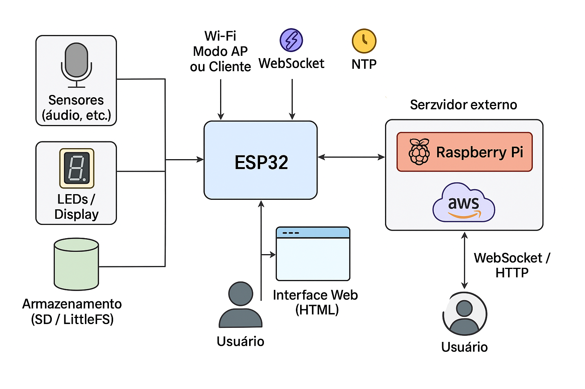

# 🎧 Monitor de Sons Ambientais para Inclusão de Crianças Autistas

Este projeto tem como objetivo desenvolver um dispositivo acessível para **monitoramento de sons ambientes**, com **interface visual local** para feedback imediato. A aplicação principal é em **salas de aula**, visando a **inclusão de crianças autistas com sensibilidade auditiva**.

## 🧠 Modelos Disponíveis

- **Portátil**: versão leve e fácil de transportar
- **Básico**: ideal para uso fixo em ambientes educacionais
- **Avançado com Rede Neural**: análise inteligente de padrões sonoros

## ☁️ Armazenamento e Pesquisa

Os dados captados são enviados para um **servidor na nuvem**, com o objetivo de apoiar **pesquisas científicas** em neurociência e educação inclusiva.

## 💡 Características Técnicas

- Interface local com feedback visual
- Armazenamento local das últimas 24h
- Conexão Wi-Fi: modo cliente ou ponto de acesso (AP)
- Interface Web para configuração e monitoramento
- Atualização remota via OTA
- Setup programável conforme o ambiente
- Licença MIT

## 🔧 Hardware Utilizado

- Microcontroladores: ESP8266, ESP32, RP2040
- Sensores de som acessíveis e de baixo custo
- Componentes disponíveis em mercados locais

## 🛠️ Desenvolvimento

- Ambiente: VSCode com PlatformIO
- Foco em baixo custo de fabricação e manutenção

## 🤝 Contribuição

Este projeto está aberto para colaboração! Pesquisadores, educadores e desenvolvedores são bem-vindos.

Este projeto representa o modelo básico do sistema ECO. Veja abaixo o diagrama de arquitetura que mostra os principais componentes e fluxos de dados.

---

Feito com ❤️ por Sandra Bati Furquim
